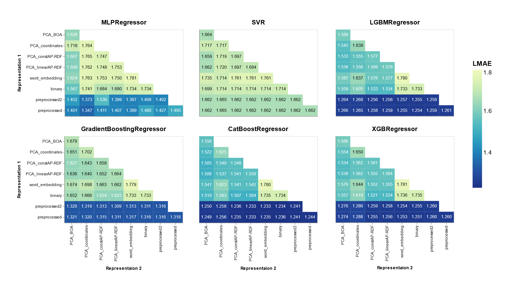

# TMLCC2021
วัยรุ่นยุคใหม่ใส่ใจปัญญาประดิษฐ์'s repository for TMLCC2021

> To ease our study, we do our best to make our research code easy to use. This way we can try out new combinations of representations and models within one line!
> Try yours as well!

## Requirements

Install python libraries:
```
pip install -r requirements.txt
```

## Usage 

### `main.py`

Train the chosen model using the input representations (can be multiple). Exhaustive grid searching can be enabled. Note that some model does not support grid search. See `opt.py` for alternatives. 
```
python main.py -r [rep1] [rep2] ... [repn] -m [model_name] -d [directory]

# Enable grid search
python main.py -r [rep1] [rep2] ... [repn] -m [model_name] -d results --grid_search

# Example
python main.py -r preprocessed linearAP-RDF -m rf -d results --grid_search

# Example (Prediction)
python main.py -r preprocessed linearAP-RDF -m rf -d results --mode test
```
*Note: `rep` should follow the representation's folder name.*

### `ensemble.py`

Take input as multiple `csv` files and compute the mean of each prediction.
```
python ensemble.py -d [directory] -p [csv_file1] [csv_file2] ... [csv_filen]

# Example
python ensemble.py -d results -p preprocessed_rf.csv preprocessed_gbr.csv
```

### `opt.py`

Run hyperparameter search with Optuna.
Only `CatBoostRegressor` and `LighGBMRegressor` are supported for now.
```
python opt.py -r [rep1] [rep2] ... [repn] -m cat -d [directory] -n [n_trials]

# Example
python opt.py -r preprocessed linearAP-RDF -m cat -d results -n 10
```

## Results



Read more at devpost, [click here](#).

## Customization

Since we have created this repository to test the efficiency of representations and models, you can
experiment on your own using your representation and your model as well. 

### Adding a representation

Whenever you run either `main.py` or `opt.py`, it will search for your tabular file in the `data` 
folder. To add a new representation, say `my_representation`, create a new folder named
`my_representation` inside the `data` folder. 

Inside the folder, you have to provide `train.csv` that contains the data. It should contain at
least 2 columns: `MOFname` and the remaining columns that represent the features. (same format as 
the origin, or see the sample at `data/preprocessed/train.csv`)

The directory should look like this.
```
tmlcc2021/data
├── my_representation
│   └── train.csv
├── preprocessed
│   ├── test.csv
│   └── train.csv
├── preprocessed2
│   ├── test.csv
│   └── train.csv
...
```

You are all set! Now you can run `main.py` using your own representation data or even combine with
one that we have created too.
```
python main.py -r my_representation -m gbr -d results --grid_search
```

### Add a new model

Our repository supports only a limited number of model. However, you can use our work to extend your
research by adding a new model by editing `runner.py`. Note that your model instance should support
basic methods such as `fit()` and `predict()`, which means that most models in `scikit-learn` and
pre-compiled neural networks model (see an example at `models/nn.py`) should work fine.

**Add a model without grid search support**
```
import MyModel                                      # import your model

MODELS = {
    'svr': SVR(verbose=2),
    'rf': RandomForestRegressor(verbose=2),
    'gpr': GaussianProcessRegressor(copy_X_train=False),
    ...,
    'my_model': MyModel(),                          # add this line
}
```

**Add a model with grid search support**
```
import MyModel                                      # import your model

MODELS_GS = {
    'svr': SVR,
    'rf': RandomForestRegressor,
    'gpr': GaussianProcessRegressor,
    ...,
    'my_model': MyModel,                          # add this line
}

TUNED_PARAMS = {
    'svr': [{'kernel': ['rbf'], 'gamma': [1e-3, 1e-4],
            'C': [1e-2, 0.1, 1, 10, 100, 1000]},
            {'kernel': ['linear'], 'C': [1e-2, 0.1, 1, 10, 100, 1000]}],
    'rf': {
        'n_estimators': [100, 200, 500],
        'min_samples_split': [2, 10],
        'min_samples_leaf': [1, 2, 4],
    },
    ...,
    'my_model': {
        'hyperparameter1': [1, 2, 3],
        'hyperparameter2': ['linear', 'rbf'],
    }
```

**Add a model with Optuna support**

This could be done similarly to previous customizations. Basically, you will need to

- Import your model
- Modify `objective()` so that it supports your model name (see '## add your model here' and edit correspondingly).

**Modify hyperparameter space**

You can easily modify the space by changing the values of the `TUNED_PARAMS` dictionary inside `runner.py`.
Configuring the search space of Optuna can be done similarly by changing the values of the dictionaries
inside the `objective()` function of the same file.


